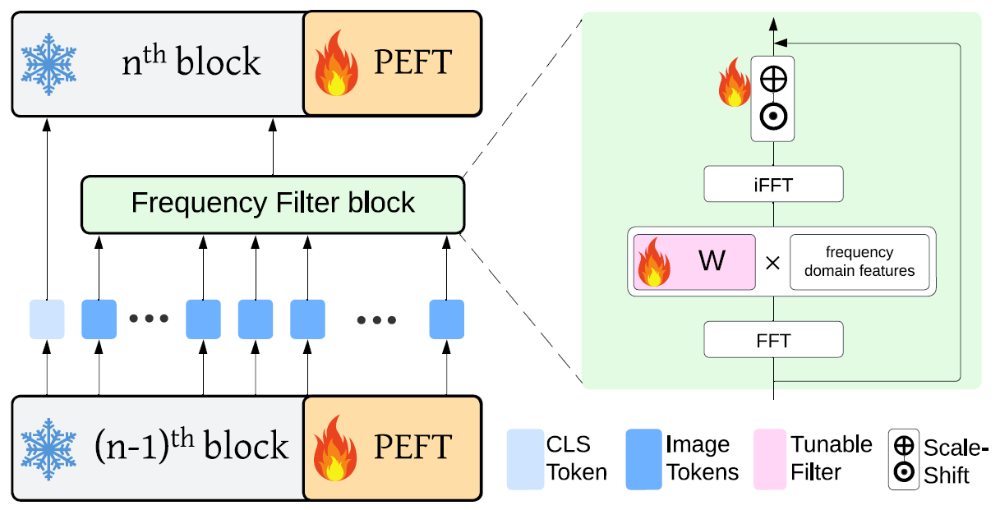
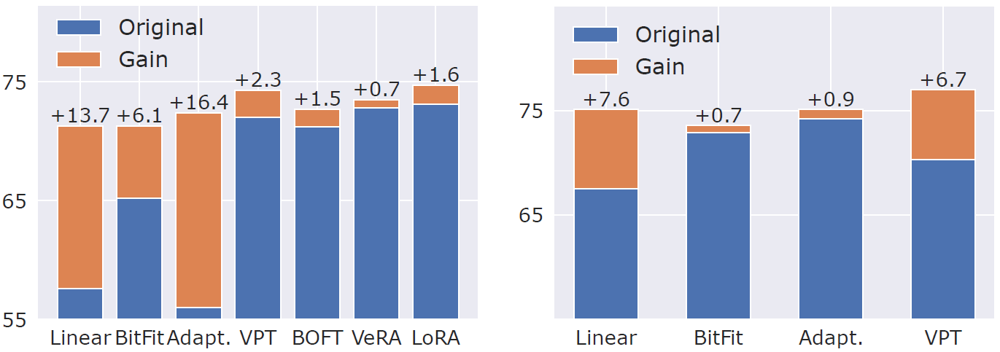

## Enhancing Parameter-Efficient Fine-Tuning of Vision Transformers through Frequency-Based Adaptation


<p align="center">


<p align="center"> (Left) Overview of FreqFit. (Right) Performance gains with (left) Imagenet-21K and (right) MoCo.
</p>


This repository is heavily based on the official PyTorch implementation of [Visual Prompt Tuning](https://github.com/KMnP/vpt) (ECCV22)

## Updates

- 01/2025: Add [Filter2DParams](https://github.com/tsly123/FreqFiT/blob/main/src/models/gfn.py#L93), a parameter-reduced version of the original [FreqFit](https://github.com/tsly123/FreqFiT/blob/main/src/models/gfn.py#L60C7-L60C21). Here, we drop the filter's complex values, reducing half of the parameters, and use this filter to adjust both the real and complex parts of the input's spectrum. We use this filter to generate the results in Tab. [ViT-L results](#vitl)

## More results

We experiment [FreqFit2D](https://github.com/tsly123/FreqFiT/blob/main/src/models/gfn.py#L60C7-L60C21) and its parameter-reduced ablation [Filter2DParams](https://github.com/tsly123/FreqFiT/blob/main/src/models/gfn.py#L93) on VTab Natural with ViT-L. More results will be updated.


<a id="vitl"></a>
| ViT-L          | Cifar100 | Caltech101 | DTD  | Flower102 | Pets | SVHN | Sun397 | Mean  | Params               |
|----------------|:--------:|:----------:|:----:|:---------:|:----:|:----:|:------:|:-----:|:--------------------:|
| LoRA           |   77.2   |    90.6    | 68.6 |    98.8   | 89.1 | 83.4 |  56.2  |  80.6 |   3.5M+0.0M        |
| FreqFit-LoRA   |   86.5   |    90.4    | 68.5 |    98.7   | 89.4 | 83.7 |  56.2  |  81.9 |   3.5M+5.7M        |
| FreqFit*-LoRA  |  86.7   |    90.4    | 68.8 |    98.7   | 89.2 | 83.5 |  56.1  |  81.9 |   3.5M+2.9M        |
|------|------|------|------|------|------|------|------|------|------|
| RLRR           |   79.0   |    90.8    | 69.3 |    98.8   | 89.3 | 87.7 |  54.9  |  81.4 |   0.76M+0.0M       |
| FreqFit*-RLRR  |  82.6   |    91.3    | 68.6 |    99.0   | 90.1 | 87.2 |  54.5  |  81.9 |   0.76M+2.9M       |

Tab. Vit-L results. FreqFit and its parameter-reduced ablation generalize well with large-scale model. FreqFit* denote the results obtained with [Filter2DParams](https://github.com/tsly123/FreqFiT/blob/main/src/models/gfn.py#L93). It is on par with the original [FreqFit](https://github.com/tsly123/FreqFiT/blob/main/src/models/gfn.py#L60C7-L60C21) with half of the parameters.


## Environment settings

See `env_setup.sh` or `assets/freqfit.yml`

## Experiments

### Datasets preparation

Please follow the [VPT Datasets preperation](https://github.com/KMnP/vpt?tab=readme-ov-file#datasets-preperation) and `VTAB_SETUP.md`

### Pre-trained model preparation

Download and place the pre-trained Transformer-based backbones to the `pretrained` folder or to
`MODEL.MODEL_ROOT`. 

Note that, for MoCo v3, different from VPT, we use the self-supervised pre-trained weights.

Once downloaded, modify the pre-trained backbones names `MODEL_ZOO` in `src/build_vit_backbone.py` accordingly.

<table><tbody>
<!-- START TABLE -->
<!-- TABLE HEADER -->
<th valign="bottom">Pre-trained Backbone</th>
<th valign="bottom">Pre-trained Objective</th>
<th valign="bottom">Link</th>
<!-- TABLE BODY -->
<tr><td align="left">ViT-B/16</td>
<td align="center">Supervised</td>
<td align="center"><a href="https://storage.googleapis.com/vit_models/imagenet21k/ViT-B_16.npz">link</a></td>
</tr>
<tr><td align="left">ViT-B/16</td>
<td align="center">MoCo v3</td>
<td align="center"><a href="https://dl.fbaipublicfiles.com/moco-v3/vit-b-300ep/vit-b-300ep.pth.tar">link</a></td>
</tr>
<tr><td align="left">ViT-B/16</td>
<td align="center">MAE</td>
<td align="center"><a href="https://dl.fbaipublicfiles.com/mae/pretrain/mae_pretrain_vit_base.pth">link</a></td>
</tr>
<tr><td align="left">ViT-B/16</td>
<td align="center">CLIP</td>
<td align="center"><a href="https://openaipublic.azureedge.net/clip/models/5806e77cd80f8b59890b7e101eabd078d9fb84e6937f9e85e4ecb61988df416f/ViT-B-16.pt">link</a></td>
</tr>
<tr><td align="left">ViT-L/16</td>
<td align="center">Supervised</td>
<td align="center"><a href="https://storage.googleapis.com/vit_models/imagenet21k/ViT-L_16.npz">link</a></td>
</tr>
</tbody></table>

### Key Configs
Configs related to certain PEFT method are listed in `src/config/configs.py`. They can also be changed in the `run.sh`.

This repo support `FreqFit` and `Scale-Shift` fine-tuning methods as presented in the paper. To change the supported method, go to `run.sh` and change to `FREQFIT "freqfit"` or `FREQFIT "ssf"`. 

### FreqFit code
- The code for `FreqFit` method is in `src/models/gfn.py`

- The code for integrate `FreqFit` into PEFT method can be found in the vision transformer backbone of methods `vit.py`, such as `src/models/vit_backbones/vit.py`.

### Adding new PEFT method
- To add new PEFT methods that are available in <a href="https://huggingface.co/docs/peft/en/index">HuggingFace</a>. Simply go to `src/models/vit_models.py`

```
...
# add VERA 
elif transfer_type == "vera":
    from peft import VeraConfig, get_peft_model
    """
    https://huggingface.co/docs/peft/en/package_reference/vera
    """
    config = VeraConfig(
        r=cfg.MODEL.VERA.R,
        target_modules=["attn.query", "attn.value", "attn.key", "attn.out", "ffn.fc1", "ffn.fc2"],
        vera_dropout =0.1,
        bias="vera_only",
        modules_to_save=["classifier"],
    )

    self.enc = get_peft_model(self.enc, config)
    for k, p in self.enc.named_parameters():
        if "ssf_scale" in k or "ssf_shift" in k or "filter_layer" in k:
            p.requires_grad = True
...
```
In the `run.sh`, modify `MODEL.TRANSFER_TYPE "vera"`. Refer to <a href="https://huggingface.co/docs/peft/en/index">HuggingFace</a> for config details.

- To add custom PEFT method, build your custom method, then add it to add the custom method to `src/models/build_vit_backbone.py` and `src/models/vit_models.py`. Refer to `LoRA` at `src/models/vit_lora/vit_lora.py` and as an example.   

### Run experiments
Modify the `run.sh` as your reference. Then run:

```
bash run.sh [data_name] [encoder] [batch_size] [base_lr] [wd_lr] [num_tokens] [adapter_ratio] [freqfit/ssf]
```
For example for the `Cifar100` dataset on `Imagenet-21k` with `LoRA` incorporate with `FreqFit`, make sure the `MODEL.TRANSFER_TYPE` and other LoRA configs have been set in `run.sh`
```
--config-file configs/finetune/cub.yaml \
MODEL.TRANSFER_TYPE "lora" \
MODEL.LORA.RANK "8" \
MODEL.LORA.ALPHA "8" \
```
Then, execute:
```
bash run.sh cifar100 sup_vitb16_imagenet21k 64 0.1 0.01 0 0 freqfit
```

## License

The majority of FreqFiT is licensed under the CC-BY-NC 4.0 license (see [LICENSE](https://github.com/KMnP/vpt/blob/main/LICENSE) for details). Portions of the project are available under separate license terms: GitHub - [google-research/task_adaptation](https://github.com/google-research/task_adaptation) and [huggingface/transformers](https://github.com/huggingface/transformers) are licensed under the Apache 2.0 license; [Swin-Transformer](https://github.com/microsoft/Swin-Transformer), [ConvNeXt](https://github.com/facebookresearch/ConvNeXt) and [ViT-pytorch](https://github.com/jeonsworld/ViT-pytorch) are licensed under the MIT license; and [MoCo-v3](https://github.com/facebookresearch/moco-v3) and [MAE](https://github.com/facebookresearch/mae) are licensed under the Attribution-NonCommercial 4.0 International license.
